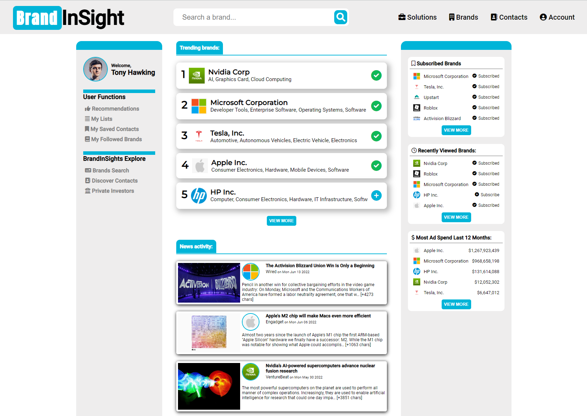
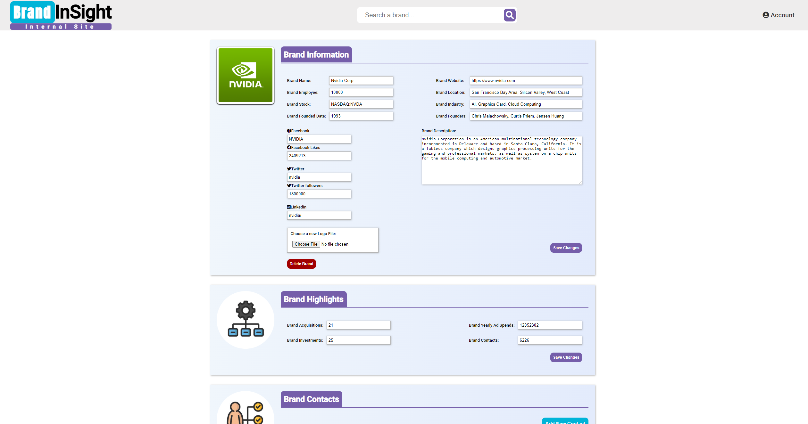

# BrandInSight 
is a platform that provides brand and business information to customers on demand. 

## Deployed Application
- [BrandInSigh ->](https://brand-insight.herokuapp.com/)

### App
A responsive full-stack CRUD application that mimics real data research startup. A landing page that introduces the startup, a client logged in home page to display user customized information, a dropdown search bar that shows instant feedback, a designated endpoint to view detailed and specific information about a brand/company. Additionally, a built-in admin tool that used by the startup internal team to add, modify, and delete any information the client can see.

This app is built with MVC design pattern. It uses MongoDB and MongoDB Atlas for data operation and storage. It uses third party libaries such as Passport, Axios, Cloudinary to support authentication, HTTP requests, and image hosting functions. It also uses data provider APIs for stock and news information. 

### Website Landing Page

### Website Logged In Home Page

### Website Individual Brand Profile Page

### Website Internal Editing Page

### Website Brand List Page

### Dropdown Search Bar With Instant Feedback

